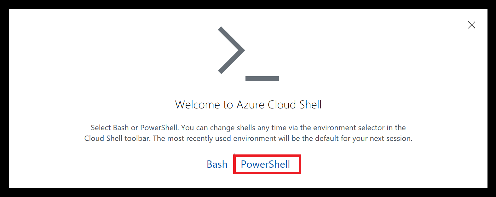
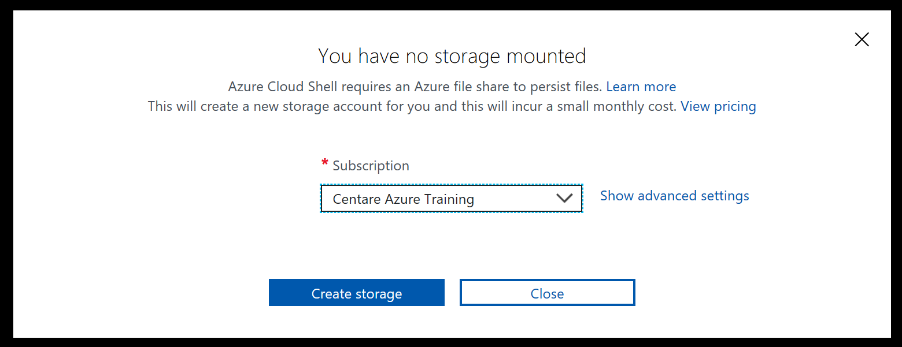

# Set up Azure Shell

  Azure Shell is a cloud based command line interface that can interact with your Azure account. Each shell session starts up an isolated environment with all of the tools needed to manage Azure resources including Azure CLI, Azure Powershell modules, docker, git, npm, and many others.  We will use this interface to run many of the exercises.

## Connect to Azure Shell

1. Navigate to shell.azure.com in a browser

2. Log in to your Azure account

3. On first launch you will have to configure your console syntax and the storage account used by the shell.
    1. A welcome screen will ask you what type of console you want to use. Select **PowerShell**.
    
    2. If you have more than one subscription select which one you want to use to persist files. A new storage account will be created for this purpose.
    
    3. Wait for the storage account to be

4. Try typing some basic commands like "cd /" and "dir"

## Initialize environment

> The Azure Shell does not support Ctrl-V for pasting commands. However, it does support right-click > Paste if you want to save typing for some of the longer commands in the exercises.

5. Set the current active subscription you will run your commands against. First, get a list of all subscriptions you have associated with your account:

    Using the Azure CLI ("az" command)
    ```bash
    az account list
    ```
    >This is a good place to try adding a format parameter, like `az account list -o table`

    Using the AZ Powershell module
    ```powershell
    Get-AzSubscription
    ```

    > Azure shell supports the Azure CLI ("az" commands) and the new Powershell AZ Module.  The Powershell module has the backwards compatibility flag set so the older \*-AzureRM\* commands will also work.

6. You will get an output with one or more subscriptions like below:

    Azure CLI
    ```powershell
    [
      {
        "cloudName": "AzureCloud",
      "id": "12345678-90ab-cdef-1234-567890123456",
        "isDefault": false,
        "name": "Visual Studio Premium with MSDN",
        "state": "Enabled",
        "tenantId": "12345678-90ab-cdef-1234-567890123456",
        "user": {
          "cloudShellID": true,
          "name": "",
          "type": "user"
        }
      },
      {
        "cloudName": "AzureCloud",
        "id": "12345678-90ab-cdef-1234-567890123456",
        "isDefault": true,
        "name": "Azure Free Trial",
        "state": "Enabled",
        "tenantId": "12345678-90ab-cdef-1234-567890123456",
        "user": {
          "cloudShellID": true,
          "name": "",
          "type": "user"
        }
      }
    ]
    ```

    AZ Powershell module
    ```
    Name     : Visual Studio Premium with MSDN
    Id       : 12345678-90ab-cdef-1234-567890123456
    TenantId : 12345678-90ab-cdef-1234-567890123456
    State    : Enabled

    Name     : Azure Free Trial
    Id       : 12345678-90ab-cdef-1234-567890123456
    TenantId : 12345678-90ab-cdef-1234-567890123456
    State    : Enabled
    ```

7. **If you have more than one subscription** - Find the name of your Azure subscription you want to use and set the current subscription for both the Azure Powershell module and AZ CLI, we will be using both.

    Azure CLI
    ```powershell
    az account set --subscription "Your Subscription Name"
    ```

    AZ Powershell module
    ```powershell
    Set-AzContext -Subscription "Your Subscription Name"
    ```

    All commands you run will now be performed on this subscription.

8. Create some Powershell variables that will be referenced in other exercises:

    ```powershell
    # Set this string to the resource group you made in exercise 1 to store your Azure SQL Server.
    $resourceGroupName = "azure-training-rg"

    # This is a string that will be added to some resource names to make sure there are no name conflicts among the class attendees. Many Azure resources require a name that is globally unique so public DNS entries can be assigned to them.
    # You can set this to any short string you think will make your resource names (like your user name).
    $uniqueString = "$(Get-Random 99999)"
    Write-Host "Your unique string is '$uniqueString', take note of this value for future exercises"
    ```
  >If you close the Azure Shell window or if it resets, you'll need to recreate your shell variables. You might want to keep track of these using the build in editor.

9. View the resource group properties to make sure you set it correctly:

    Azure CLI
    ```powershell
    az group show --name "$resourceGroupName"
    ```

    AZ Powershell module
    ```powershell
    Get-AzResourceGroup -Name $resourceGroupName
    ```

10. Change to your home directory. Any files uploaded to this directory will be persisted across sessions in the storage account you created earlier.

    ```powershell
    cd $home
    ```

11. Clone the Git repository with all of the exercises and code.

    ```powershell
    git clone https://github.com/centaretraining/azuretraining
    ```

12. Change the current working directory to the **azuretraining** folder. All exercises will assume you are in this subfolder:

    ```powershell
    cd $home/azuretraining
    ```

You are now ready to start!

**KEEP THIS BROWSER WINDOW OPEN!** We will reuse some of the variables and environment settings

Next: [Create a SQL Server](03-azure-sql.md)