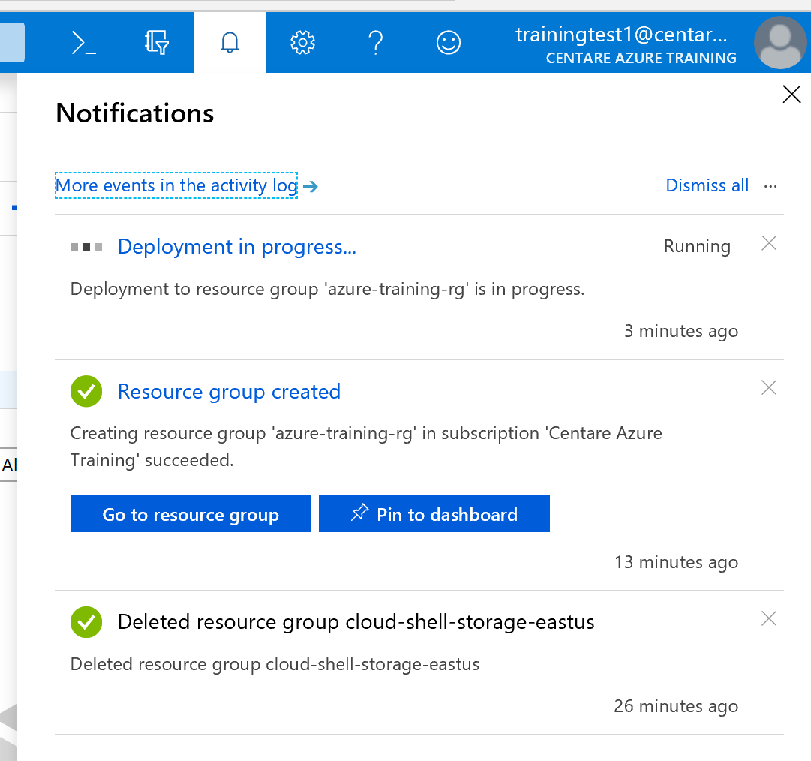

# SQL Server in Azure


You’re going to create a SQL Server Database in Azure. We will use this database in subsequent exercises as the back end for a lunch ordering system. You can use the portal or the CLI. Instructions for both are included in this step.

## SQL Server (in the portal)

Steps

1. Open the portal (portal.azure.com)

2. Click "Create a Resource" (top left corner)

3. Click "Databases" then "SQL Database". If you don't see it, search for SQL Database and select that.

4. Fill out the Basic Tab

	- Select a subscription
	- Select the resource group you created in the previous step
	- Enter **"lunch-db"** as the database name
	- Under Server, click “Create New”
	- Fill out the server name. Server names must be globally unique, so use something like **"lunch-[your user name]-sql"**
	- Enter the server admin credentials and pick an admin password.

	- Click “Next”

> Take note of the server name, user name, and password you selected. We will be using this Azure SQL Server for subsequent exercises.

5. On the Additional Settings and Tags tabs, Click Next

6. Click Create

7. A new message will pop up in your Notifications menu for your resource deployment that will alert you when the deployment is complete.

	

Once the database is deployed (this takes a few minutes), you can click **Go to resource** in your Notifications or to the SQL databases resource in the left menu. Feel free to connect to the server using your preferred SQL tool (SQL Server Management Studio or Visual Studio)

## SQL Server (using the CLI)

1. Setup some variables

```PowerShell
$adminLogin='ServerAdmin'

#change this to a better password...
$password='Password1234!'

#change this to something unique
$servername='server-name'

#change this to your resource group from step 1
$resourceGroup='an existing resource group'

#This is the DB we'll use later
$databaseName='lunch-db'
```

2. Create a Database Server

```PowerShell
az sql server create `
	--name $servername `
	--resource-group $resourceGroup `
	--location northcentralus  `
	--admin-user $adminLogin `
	--admin-password $password
```

3. Make a database on the server

```PowerShell
az sql db create `
	--resource-group $resourceGroup `
	--server $servername `
	--name $databaseName `
	--service-objective S0
```
Next: [Build a Web Application](04-web-apps.md)