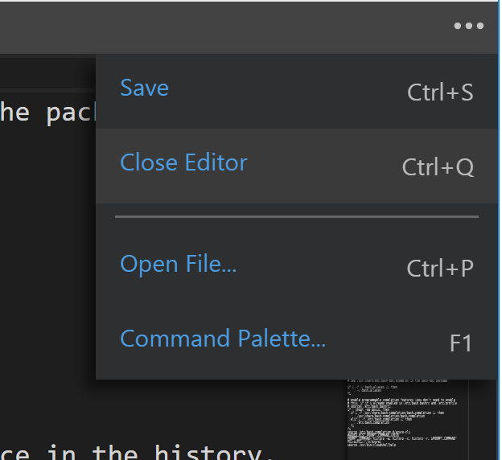
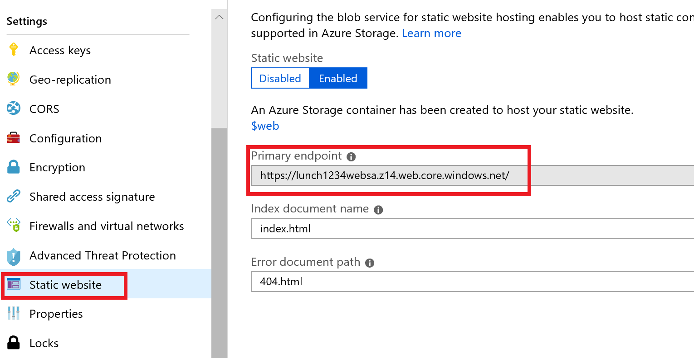

# Azure Functions and CosmosDB with ARM templates

In this exercise we will deploy a static single page application and backing web service to a completely serverless setup (no servers to manage or scale, charges will be entirely based on resource usage).

The application consists of an ASP.Net Core API project, and an Angular single page application.  The API will be hosted in Azure Functions using a consumption based pricing model, the static SPA website will be served directly from an Azure storage BLOB, and the data will be stored in a Cosmos DB database.

All resources will be created with ARM templates.

## Azure Shell file editor

1. Follow the instructions in the [Azure Shell Exercise](./03-azure-shell.md) if you have not already to connect to [Azure Shell](shell.azure.com).  

    - Make sure you are in the azuretraining folder under you $home directory.
        ```powershell
        cd $home/azuretraining
        ```
    - Make sure your **$resourceGroupName** and **$uniqueString** variables are set:
        ```powershell
        if ("$resourceGroupName" -eq "") { Write-Error '$resourceGroupName is NOT set!' } else { '$resourceGroupName is set!' }

        if ("$uniqueString" -eq "") { Write-Error '$uniqueString is NOT set!' } else { '$uniqueString is set!' }
        ```

2. The Azure Shell includes a file editor that we will be using to view and modify files for the exercises.  Click on the "{}" icon at the top of the window to open the editor.  You will see the folder structure of your $home drive (/home/[your user name]).

    

3. Close the editor using the "..." menu in the upper right corner.

    

## ARM templates

4. Open the ARM template file **/azuretraining/serverless-cli/src/ServerlessFoodOrder.ArmTemplates/azuredeploy.json**. This is the root ARM template which references the child ARM templates in the "templates" folder.  Review the resources that will be created when you deploy this template.

> Some items to note about the template:
>    - All of the resource types in azuredeploy.json are of type "deployment".  A deployment is itself a type of resource which is used to track the inputs, outputs, and status of the deployment, which itself could include additional child deployments.
>    - Some of the resources have dependencies on other deployments. Azure Resource Manager will figure out the dependency graph and deploy as many resources in parallel as it can.
>    - The child templates are referenced by a URL (built from the _artifactsLocation parameters) NOT from a local file path.  Azure Resource Manager runs in the cloud and must be able to download the child templates from an internet accessible location.  The deployment script will create a storage account, upload the child templates, and pass this URL in as a parameter.
>    - All child templates get their parameters passed to them from the parent template.
>    - The function app template gets some of its parameters from the output of the other templates. For example - the access key for the CosmosDB instance is output from the cosmosdb.json ARM template and this value is passed into the Function App ARM template so the key can be stored in the Function App's configuration settings.


3. Open the **azuredeploy.parameters.json** file.  This file contains the parameter values that will be passed to the ARM template.  All of the resources we are creating **must have a unique name**.  Update the values by replacing "[put a unique string here]" with a short string that should be unique among the class attendees (like your user name or the random number generated at the beginning of this exercise).

> **Note** Storage account names can't contain dashes, so don't use those in the storage account name variables.

4. Run the deployment script. This will take a while to provision all of the resources.

    ```powershell
    ./serverless-cli/src/ServerlessFoodOrder.ArmTemplates/Deploy-AzureResourceGroup.ps1 -ResourceGroupName $resourceGroupName
    ```

    > What is happening here:
    >
    > The Deploy-AzureResourceGroup.ps1 script is the default script created by Visual Studio when you make a new ARM Template project.  When it runs it:
    >  1. Creates the target resource group if it doesn't exist
    >  2. Creates a storage account (if it doesn't already exist) to store the deployment artifacts. This includes all ARM templates and a zip file of the compiled Function App.
    >  3. Creates a time limited SAS token that ARM can use to access the artifacts.
    >  4. Uploads the artifacts to the storage account.
    >  5. Executes the ARM template using the New-AzureRmResourceGroupDeployment command, passing in the root ARM template, parameter file, and parameter values for the artifact storage account URL and SAS token.

5. While the deployment is running we will update the single page app with the URL of our API. Go to the **/azuretraining/serverless-cli/src/ServerlessFoodOrder.Web/dist** folder and edit **index.html**.
Change the section

    ```javascript
    var globalConfig = {
      apiDomain: "https://[Your API function name].azurewebsites.net"
    };
    ```

    by replacing "[Your API function name]" with the name of the function app you put in your azuredeploy.parameters.json file.
    
    > Normally this process would be done as part of a build pipeline

6. Wait for the deployment to complete. It may take several minutes to provision all resources.

7. Enable static website hosting on your web storage account.  There currently isn't a way to do this via ARM templates, so we must execute a command to update the existing storage account.

    ```powershell
    # Set this to the website storage account you specified in the azuredeploy.parameters.json file.
    $storageAccountName = "lunch$($uniqueString)websa"
    az storage blob service-properties update --account-name $storageAccountName --static-website --404-document 404.html --index-document index.html
    ```

10. Upload the website to the $web container in the storage account created by the static website hosting feature.

    ```powershell
    az storage blob upload-batch -s ./serverless-cli/src/ServerlessFoodOrder.Web/dist -d '$web' --account-name $storageAccountName
    ```

11. Update the CORS settings to allow cross
    * Get the url for your static site

    ```powershell
    $staticWebUrl = az storage account show -n $storageAccountName -g $resourceGroupName --query "primaryEndpoints.web" --output tsv
    $staticWebUrl = ($staticWebUrl).Replace(".net/",".net")
    ```
    * Add it as an allowed origin to the CORS settings on your function app
    ```powershell
    # Set this to the Function name you specified in the azuredeploy.parameters.json file.
    $functionAppName = "lunch-$uniqueString-func-fa"
    az functionapp cors add -g $resourceGroupName -n $functionAppName --allowed-origins $staticWebUrl
    ```
12. Go to the [Azure Portal](portal.azure.com) and navigate to your web storage account (lunch[unique string]websa)

13. Click **Static website** in the left menu

14. Copy the **Primary Endpoint** value and open a browser tab to this URL.  The home page should be displayed.  There are currently no menu items in CosmosDB.  Click on the **Add Menu Option** menu item and add some products and submit some orders to verify your function is working.

    

Next: [Azure Service Bus](07-messaging-service-bus.md)
