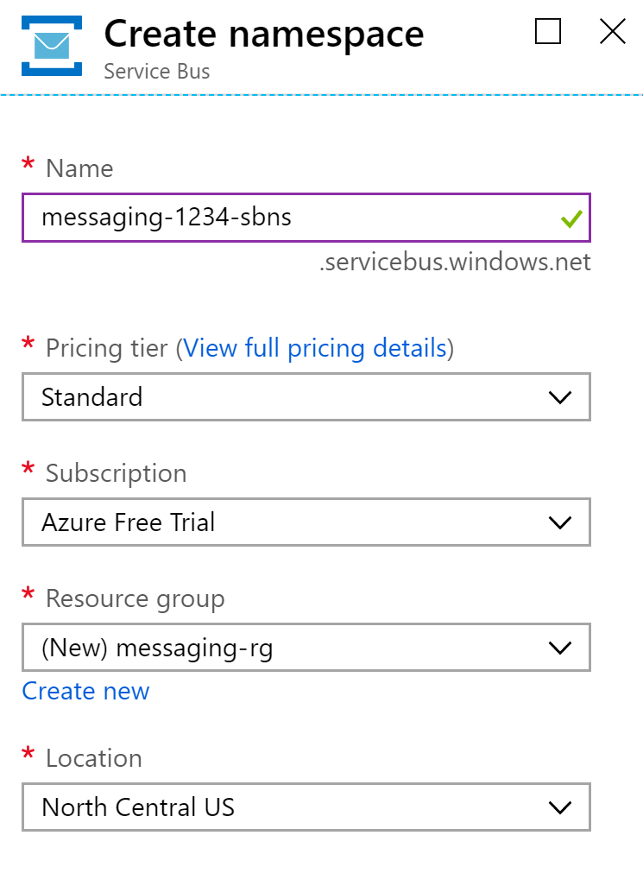
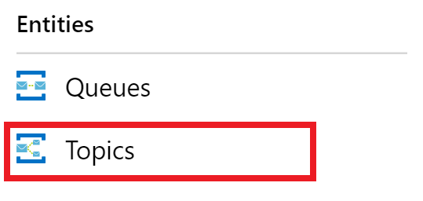
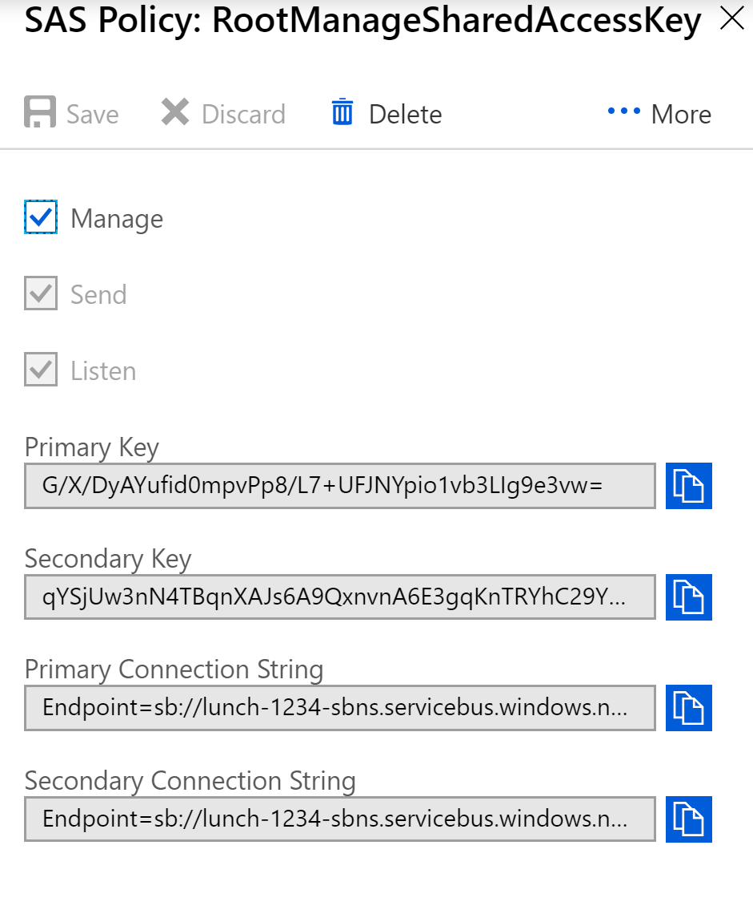
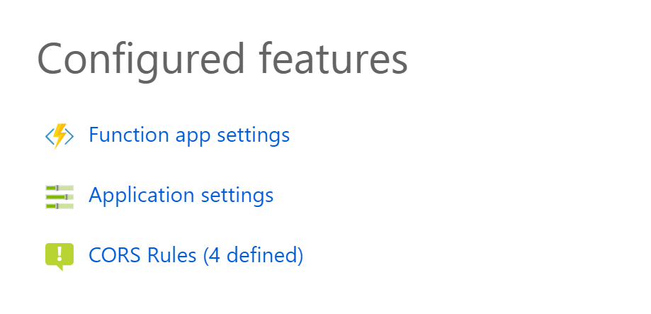

# Events with Azure Service Bus

In this exercise we will use Azure Service Bus to publish and subscribe to an "Order Placed" event message from the customer lunch ordering interface.

## Create an Azure Service Bus namespace

To begin using Service Bus messaging in Azure, you must first create a namespace with a name that is unique across Azure. A namespace provides a scoping container for addressing Service Bus resources within your application.

To create a namespace:

1. Open the [Azure portal](https://portal.azure.com)

2. In the left navigation pane of the portal, select **+ Create a resource**, select **Integration**, and then select **Service Bus**.

3. In the **Create namespace** dialog, do the following steps: 
    1. Enter a **name for the namespace** such as **"[Your CMUTUAL user name]-lunch-sbns"**.
    2. Select the **Standard** pricing tier. We will be creating Topics which are not supported in the Basic tier.
    3. Select your **Subscription** in the drop down.
    4. Select your **Resource group**, choose an existing resource group in which the namespace will live, or create a new one.
    5. For **Location**, select "North Central US".
    6. Select **Create**. The system now creates your namespace and enables it. You might have to wait several minutes as the system provisions resources for your account.

        

4. On the **Resource group** page for your resource group, select your **service bus namespace**. 

5. You see the home page for your service bus namespace. 

    > A service bus namespace is the scope at which you scale your messaging throughput. All queues, topics, and subscriptions in a namespace will share the same resource pool.

## Create a topic and subscribers

6. On the Service Bus Namespace page, select **Topics** on the left menu.

    

7. Select **+ Topic** on the toolbar.

8. Enter **"order-placed-sbt"** for the topic name. Leave the other options with their default values.

9. Select **Create**.

10. Select the topic that you created in the previous step.

11. On the Service Bus Topic page, select Subscriptions from the left menu, and then select **+ Subscription** on the toolbar.

12. On the Create subscription page, enter **"cc-processor-sbs"** as the name for the subscription, and then select **Create**.  This will be the subscription for a credit card processing application that will charge the users card when a new order is placed.

13. Repeat this step, entering **"notify-processor-sbs"** as the name for the second subscription. This will be the subscription for an application that notifies the kitchen when a new order is placed.

## Update the config for the lunch ordering app

The customer interface website deployed to Azure App Services will publish an "OrderPlacedEvent" to Azure Service Bus when new orders are created if a configuration values exist named "ServiceBusConnectionString" and "ServiceBusTopicName".

14. Get the connection string for the service bus:

    Creating a new namespace automatically generates an initial Shared Access Signature (SAS) rule with an associated pair of primary and secondary keys that each grant full control over all aspects of the namespace. To copy the primary and secondary keys for your namespace: 

    1. Click **All resources**, then click the newly created namespace name.
    2. In the namespace window, click **Shared access policies**.
    3. In the **Shared access policies** screen, click **RootManageSharedAccessKey**.
        
    4. In the **Policy: RootManageSharedAccessKey** window, click the copy button next to **Primary Connection String**, to copy the connection string to your clipboard for later use.
    
        

15. Navigate to your Function App in the portal. Under "Configured Features" click on **Application settings**. 

    

16. Create two new settings named **"ServiceBusConnectionString"** and **"ServiceBusTopicName"**.  Paste the connection service bus string into **"ServiceBusConnectionString"** and the topic name **"order-placed-sbt"** into the **"ServiceBusTopicName"**.  Click **Save** at the top of the form.

<!--
 the script below and run it to add a new config variables to the web app named "ServiceBusConnectionString" and "SerivceBusTopicName":

    ```powershell
    # Paste your connection string here
    $serviceBusConnectionString = "[connection string here]"
    # Enter your topic name here
    $topicName = "order-placed-sbt"

    # Get the current app settings
    $apiApp = Get-AzureRMWebApp -ResourceGroupName $resourceGroupName -Name $apiAppServiceName
    $appSettingList = $apiApp.SiteConfig.AppSettings

    $newAppSettings = @{}
    ForEach ($kvp in $appSettingList) {
        $newAppSettings[$kvp.Name] = $kvp.Value
    }

    # Add new settings
    $newAppSettings["ServiceBusConnectionString"] = $serviceBusConnectionString
    $newAppSettings["ServiceBusTopicName"] = $topicName

    # Update settings
    Set-AzureRmWebApp -AppSettings $newAppSettings -Name $apiAppServiceName -ResourceGroupName $resourceGroupName
    ```
--->

16. Go to your customer order Web Application and place a few orders. After a short period of time you should be able to go back to your service bus topic overview page and under the Subscriptions the message count should match the number of orders you've placed.

<!--
## Send and receive messages with the REST API

While Azure Service Bus supports messaging protocol standars like AMQP, you can also send and receive messages using standard HTTP calls.

1. Open the [Azure Shell](https://shell.azure.com) in a browser.
2. To send a message to the service bus you POST to the URL **[service bus namespace].servicebus.windows.net/[topic name]/messages**.  Your SAS token must be in the **SharedAccessSignature** header field.
    ```powershell
    $message = "Hello Service Bus!"
    # Put your shared access key here
    $sas = "GxAjU/slEQVNNvmxbtrh3WDSDOZNy137+azn6INdEYM="
    $serviceBusNamespace = "messaging-test-sbns"
    # Put the name of the topic you want to publish a message to here
    $topicName = "test-sbt"
    curl google.com --data "$message" --header "SharedAccessSignature $sas" $serviceBusNamespace.servicebus.windows.net/$topicName/messages
    ```

3. To retrieve messages you DELETE from the same URL. Service Bus takes an HTTP DELETE because you are atomically reading and removing the message from the queue so no other consumers will get it.
    ```powershell
    # Put the name of the subscriber here
    $topicName = "test-sbt"
    curl google.com --data "$message" --header "SharedAccessSignature $sas" $serviceBusNamespace.servicebus.windows.net/$topicName/messages
    ```

. Try posting multiple messages with different data and pulling them off the message bus

-->

## Receive order events

1. Open your [Azure Shell](https://shell.azure.com) browser window.

2. Start the Credit Card Processor application. This is a simple .Net Core console application that listens for events on a subscription you specify in the command line.

    ```powershell
    # Enter the connection string you copied earlier
    $serviceBusConnectionString = "[Your connection string goes here]"
    
    $topicName = "order-placed-sbt"
    
    $ccSubscriptionName = "cc-processor-sbs"
    
    dotnet run --project ./service-bus/src/Events.CreditCardProcessor `
        $serviceBusConnectionString `
        $topicName `
        $ccSubscriptionName
    ```

3. The application should start receiving the OrderPlacedEvent messages you generated earlier.  There is a built in sleep of 5 seconds when an event is received to simulate the application doing some work.

4. Hit the ENTER key to stop this application. Now run the Notification application. Because this application will be listening on a different subscription, it will receive the same messages that the Credit Card Processor application received.

    ```powershell
    $ntfSubscriptionName = "notify-processor-sbs"

    dotnet run --project ./service-bus/src/Events.Notifications `
        $serviceBusConnectionString `
        $topicName `
        $ntfSubscriptionName
    ```

5. Leave the application running and try placing more orders.  Watch as the events are picked up immediately after the order save operation completes.

<!--
6.  Keep the notification app running and open an additional shell.azure.com window and run a second copy of the Notification Processor

    ```powershell
    $serviceBusConnectionString = "[Your connection string goes here]"
    $topicName = "order-placed-sbt"
    $ntfSubscriptionName = "notify-processor-sbs"
    
    dotnet run --project ./service-bus/src/Events.Notifications $serviceBusConnectionString $topicName $ntfSubscriptionName
    ```

7. Start placing lots of orders in quick succession by hitting the **Random Order** button on the web application.  Switch between the two shell.azure.com windows and notice how the events are only being picked up by one instance, doubling the processing throughput of the events.

> This is referred to as the "competing consumer" model for message processing.  Simply by adding more consuming applications on a queue or subscription messages will be processed in parallel. You can rely on the Service Bus to atomically lock the messages so they only get delivered once to each consumer in your processing pool.

-->

Next: [Azure Network Security](./08-network-security.md)
