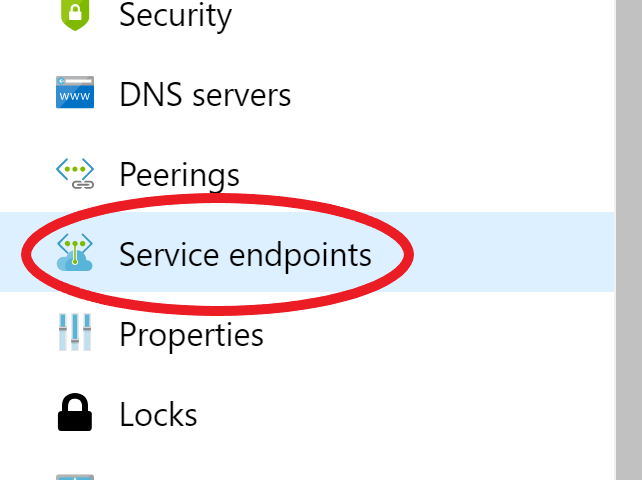
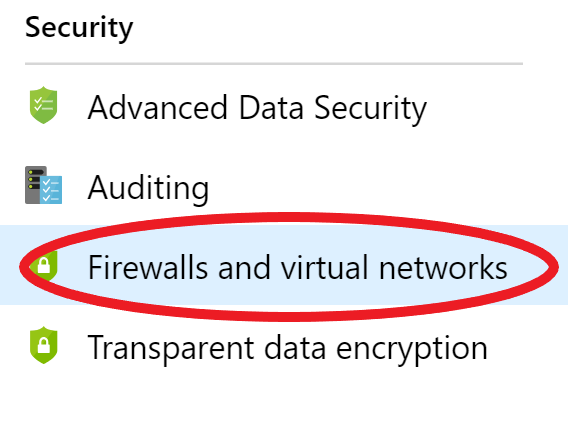
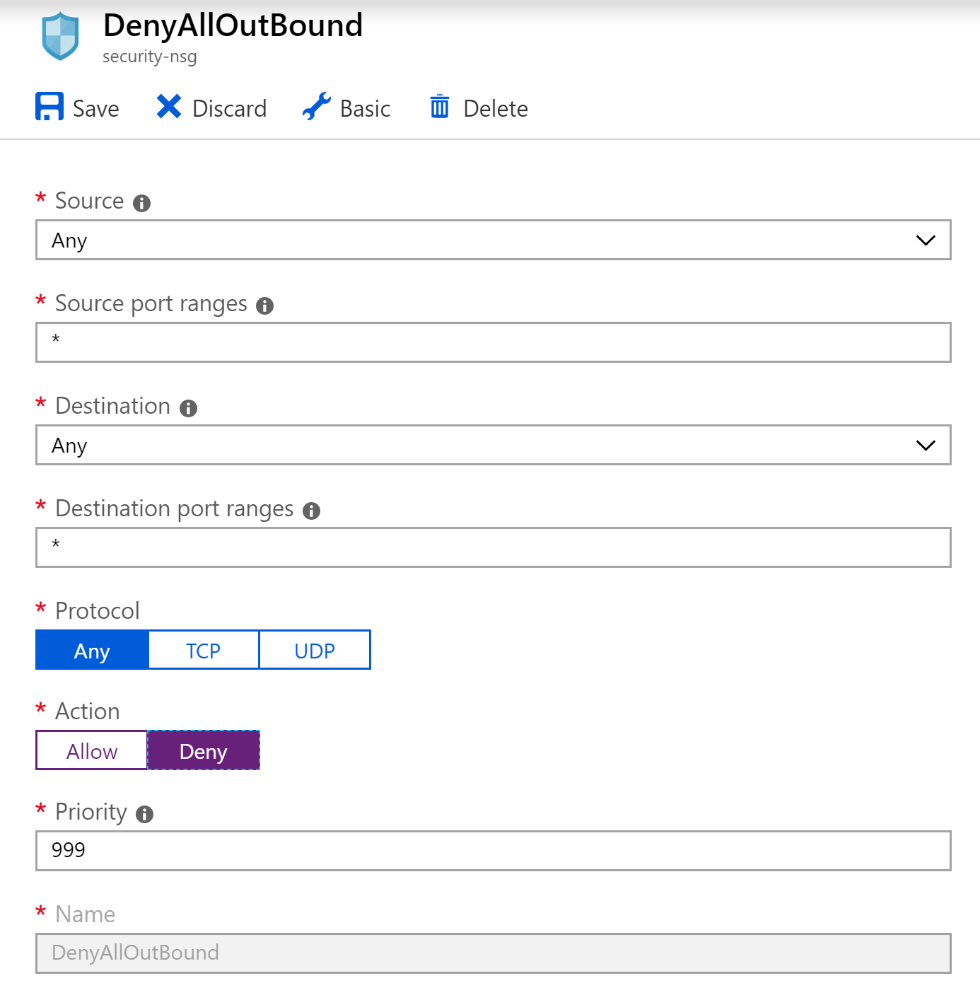
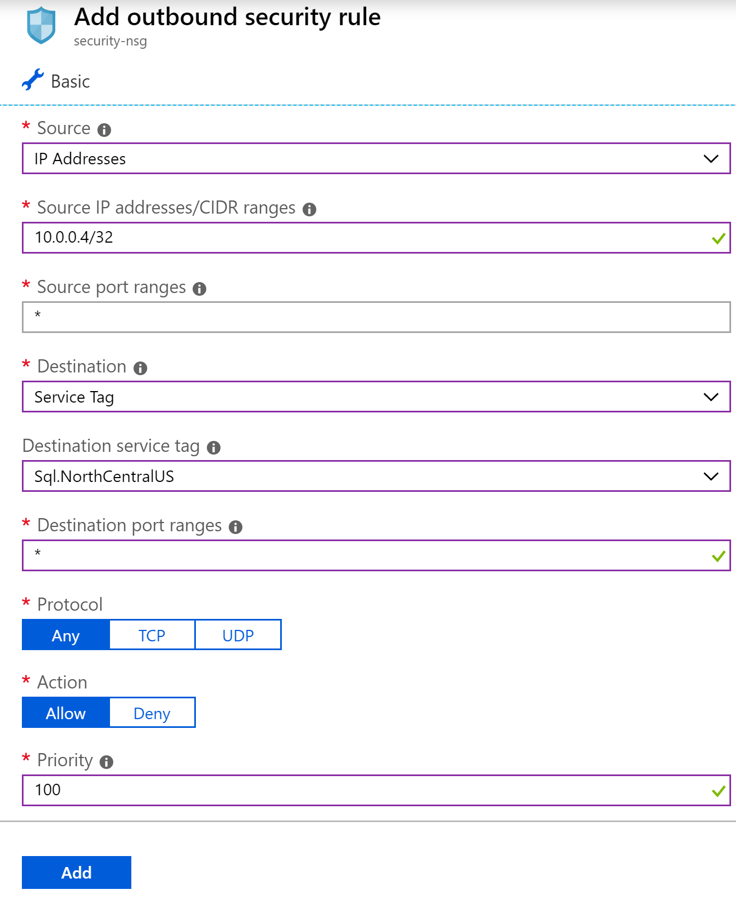

# Network Security

In this exercise we will secure the Azure Web App created in exercise #4 at the networking layer.  We will lock down access to the SQL Server from a private VNet and apply Network Security Group rules so only one VM on the subnet can access it.

## Create a service endpoint to Azure SQL

1. Edit the azuredeploy.parameters.json file in the /security-web-apps/ and replace the "[unique string here]" in the parameter values with a unique value to avoid naming conflicts.

1. Deploy the ARM template that will set up a VNet with one private subnet and a VM in it we can use for testing.

```powershell
# If your $uniqueString and/or $resourceGroupName variables are not set, set them  here
# $uniqueString = "$(Get-Random 99999)"
# $resourceGroupName = "azure-training-rg"
cd $home/azuretraining
az group deployment create --resource-group "$resourceGroupName" --template-file ./security-web-apps/azuredeploy.json --parameters '@./security-web-apps/azuredeploy.parameters.json' --parameters "{'uniqueString': { 'value': '$uniqueString' }}" --verbose
```

2. Once the deployment is complete open up the [Azure Portal](https://portal.azure.com) and navigate to the Virtual Network resource "security-vnet"

3. Select the "Service endpoints" menu option

    

5. Click "Add"

6. Select the "Microsoft.Sql" service and the "service-sn" subnet from the drop downs.

This will switch outgoing traffic from your private subnet to this Azure service to use your private address space, allowing you to lock down the Azure service to specific resources inside your private virtual network address space. 

3. Go back to your resource group and open the VM resource "security-vm".

4. Select the Settings --> Networking menu option on the left

5. Take note of the "Private IP" address.  Because you created a service endpoint for Azure SQL on this VNet requests to Azure SQL will stay within the Azure network and connect from the private IP address instead of traversing the internet and appearing as the public IP address.  This means that giving this VM a publicly addressable IP is not necessary.  However, we will keep the public address around so we can RDP into the machine to test our configuration.

    

## Configure Azure SQL to whitelist your subnet

6. Navigate back to the resource group with your Azure SQL Server and select that resource (make sure to select the "SQL server" resource type, not the "SQL database").

7. Select the Security --> Firewalls and virtual networks menu option on the left

    

8. Under the Virtual Networks section click "+ Add existing virtual network"

9. Enter a unique name for the rule and select the "security-vnet" virtual network and "security-sn" subnet from the drop downs.

10. Connect to the VM using RDP.  On Properties Page --> Click Connect to Download RDP file --> Save and Open RDP file.

    > After selecting the subnet the status of the service endpoint for Azure SQL in this VNet will be displayed.  If you did not create a service endpoint earlier the portal will give you the option to create it from this menu.

11. Click "OK" to create the rule.

## Test the service endpoint

12. Log in with the user name "securitytraining" and password "Security1!"

13. Open the Start menu and start Microsoft SQL Server Tools 17 --> SQL Server MAnagement Studio

14. Enter your database URL ([your SQL server name].database.windows.net), select SQL authentication, and enter the admin user name and password for your Azure SQL Server.

15. You should be connected to the server and be able to execute SQL commands.  Even though access to all Azure services have been removed and no IP addresses are in the whitelist, you can connect to the server through your VM since it is in a VNet that has an Azure SQL Server Service Endpoint and is in a subnet that has been granted access to the SQL Server.

    > Keep the RDP session open, we will be returning to it in the next section.

## Remove access via a Network Security Group

16. Go back to the [Azure Portal](https://portal.azure.com) and click **Create a resource** in the upper right.

17. Choose **Networking** and select the **Network security group** resource.

18. Name the security group **security-nsg** and select your subscription and resource group.  Make sure the location is **North Central US**.

19. Once your NSG is deployed navigate to it and click on the **Subnets** menu on the left.

20. Click the **Associate** button and select the VNet and Subnet that your Virtual Machine is in.  Click the **OK** button to save the association.

23. Click on **Outbound Security Rules** in the menu on the left and click the **Add** button to create a new rule to deny all outbound traffic:

    1. Select **Any** in the **Source** dropdown
    2. Enter **"\*"** as the source port.
    3. Select **Any** in the **Destination** dropdown.
    4. Enter **"\*"** as the destination port.
    5. Name the rule something like **"DenyAllOutBound"**
    6. Select **Deny** for the **Action**
    6. Set the **Priority** as **999**
    8. Click **Add**

    

24. Wait a minute or so for the rule to take effect.

21. Open your RDP session again and attempt to connect to the Azure SQL Server.  You will not be able to connect since outbound traffic on port 1433 to the Azure SQL service is not explicitly allowed.

## Add explicit access to the VM

22. Open the [Azure Portal](https://portal.azure.com) and navigate back to the Network Security Group you just created.

    1. Select **IP Address** in the **Source** dropdown
    2. Enter the private IP address of the Virtual Machine with a "/32" at the end to signify a single IP instead of a range.
    3. Enter **"\*"** as the source port.
    4. Select **Service Tag** in the **Destination** dropdown.
    5. Select **Sql.NorthCentralUS** in the **Destination Service Tag** drop down. 
    6. Enter **"\*"** as the destination port.
    7. Name the rule something like **"AllowSqlNorthCentralUSFromVM"**
    8. Click **Add**

    

24. Open your RDP session again and attempt to connect to the Azure SQL Server. You should be able to open a connection to the server and execute commands again.

Next: []